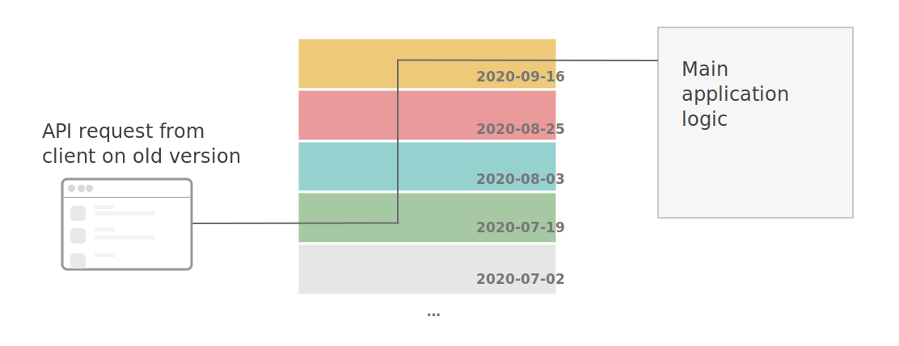
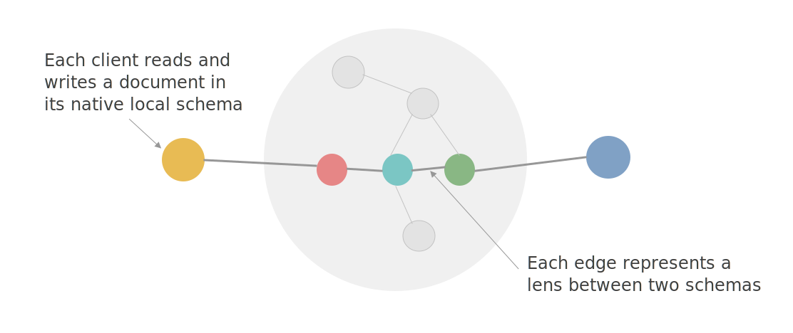
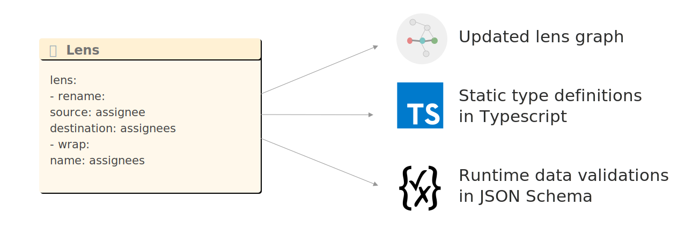

# Project Cambria: Translate your data with lenses

- [source](https://www.inkandswitch.com/cambria.html)
- [[ink & switch]]

## Introduction

- We propose a principled replacement for these messy solutions: an isolated software layer that translates data between schemas on demand. This layer allows developers to maintain strong compatibility with many schema versions without complicating the main codebase. Translation logic is defined by composing bidirectional lenses, a kind of data transformation that can run both forward and backward.
- Backward compatibility is straightforward. It’s the ability to open old documents in new versions of the program. Forward compatibility, the ability to open documents in formats invented in the future, is rarer. We can see forward compatibility in web browsers, which are written so the features added to HTML won’t break the ability to render new sites in old browsers.

### Stripe API versioning

- Stripe has developed an elegant approach to this problem. **They have built a middleware system into their API server that intercepts incoming and outgoing communication, and translates it between the current version of the system and the client’s requested version.** When they want to change the API’s format, they can add a new translation to the “stack” in their middleware, and incoming requests will be translated to the current version.
  
- The Stripe's implementation limitations are that Develipers have to implement translations themselves and write tests to ensure they are correct. And because Stripe’s system uses dates to order its migrations, it is limited to a single linear migration path.

### Kafka and message formats

- [Apache Kafka](https://kafka.apache.org/) is a scalable, persistent queue system often used for this purpose
- Kafka’s streams can require both backward and forward compatibility. Old messages must be readable by new consumers; new messages must be readable by old consumers.
- To help manage this complexity, the Confluent Platform for Kafka provides a [Schema Registry](https://docs.confluent.io/current/schema-registry) tool. This tool defines rules that [help developers](https://docs.confluent.io/platform/current/schema-registry/avro.html) maintain schema compatibility
- The Schema Registry can help prevent a team from deploying incompatible schemas, but it does so by limiting the changes that can be made to schemas.

### Mastodon protocol evolution

- [Mastodon](https://joinmastodon.org/) servers exchange data using the open-ended [ActivityPub](https://www.w3.org/TR/activitypub/) standard
- Each local server, of course, can do as it wants.
- But with each system implementing these ideas locally, there is no easy way to disseminate these improvements globally. If two servers handle sensitive content in different ways, must each support both formats forever?
- with many implementations out there, there’s no clear path for administrators to choose which ones to adopt and when.
- **The more implementations and servers, the harder it is to change the protocol.** The IRC network has struggled with these problems for many years, an issue so serious that one of the key features of the latest IRC protocol, IRCV3, is just the ability to make future changes!

### 10x harder: decentralized data schemas

- [[local first]] software can run entirely on users’ computers and yet support real-time collaboration, we’ve run into all kinds of problems with upgrading to new versions of code.
- We would frequently end up writing code like this snippet, which needs to handle two cases: the case where doc already has a tags array, and the case where it doesn’t have one yet because older versions of the application didn’t populate that property in the document.

```javascript
if (doc.tags && Array.isArray(doc.tags)) {
  doc.tags.push(myNewTag)
} else {
  // Handle old docs which don't have a tags array
  doc.tags = [myNewTag]
}
```

- These kinds of sequencing problems are rare in centralized systems, but common for decentralized systems.

### Distributed Schema evolution is a shared problem

- There is a deep sense in which these are all the same problem. Data schemas can only change in so many ways. Evolving schemas may add or remove fields, rename or relocate them, change their cardinality, or convert their type from one form to another. To manage this complexity, programs must check fields for existence, fill in defaults, and migrate old data into new shapes.
- Instead of managing these problems in an ad hoc way, we can build on the insights of the Stripe and Confluent teams and provide a satisfying framework that solves them consistently and reusably across all these problem domains. We can make it radically easier to support many versions of data all at once.

## Introducing a schema evolution tool: Cambria

- _We have developed a schema evolution library called Cambria that supports real-time collaboration between different versions of an application with different schemas. It works by giving developers an ergonomic way to define bidirectional translation functions called lenses[^1]._
- When a developer defines a single lens, it can translate data in both directions, eliminating the need to specify separate forward and backward translations.
- Over time, a project using Cambria will accumulate many lenses, each describing the relationship between two versions. **Migrations between distant versions are created by composing lenses into a graph where each node is a schema, and each edge is a lens**. To translate data between two schemas, **Cambria sends it through the shortest available path in the lens graph**. These lenses must be kept in a place where even old versions of the program can retrieve them, such as in a database, at a well-known URL, or else as part of the document itself.
  

### Working with Cambria

- Our goal was to use Cambria to achieve full compatibility. Users should be able to collaborate on a document regardless of the software version they’re running. New clients should be able to open documents created by old clients, and vice versa.

#### Lenses in Action

##### Adding more issue statuses

```javascript
// original document
{
  "name": "Dig a hole in the desert",
  "complete": false
}

// lens
- rename:
    source: complete
    destination: status
- convert:
    name: status
    mapping:
      - 'false': todo
        'true': done
      - todo: false
        inProgress: false
        done: true
        default: false
    sourceType: boolean
    destinationType: string

// evolved document
{
  "status": "todo",
  "name": "Dig a hole in the desert"
}
```

- A lens that converts a boolean complete value to a string status value.
- Note that in the second step, we define mappings in both directions, so that a boolean can be converted to a string, and vice versa.
- Each client edits the task using its native data structure, and **Cambria translates those edits back and forth**. In many other systems renaming a field between schema versions is a complicated process, but here it just requires writing a small lens.

##### Supporting multiple assignees

- As in the previous example, perfect compatibility is impossible. The old client knows only how to display a single assignee. If someone uses the new client to assign multiple people to a task, there’s no way to present that information in the old client.
- However, we can still make a best effort to maintain compatibility. We can write a lens using the `wrap` operator, which translates a scalar value into an array. When the array contains a single element, both sides show the same information. When multiple elements are present in the array, the scalar value reflects the first element in the array.
- Depending on the context, less-than-perfect translations like these might be useful or confusing. If at some point the costs outweigh the benefits, the best option might be to require all collaborators to upgrade. Cambria doesn’t force users to collaborate across versions with imperfect compatibility, but it provides the option of doing so.

```javascript
// original document
{
  "name": "Dig up a T-Rex",
  "assignee": "Bob"
}

// lens
- rename:
    source: assignee
    destination: assignees
- wrap: { name: assignees }

//evolved document
{
  "assignees": [
    "Bob"
  ],
  "name": "Dig up a T-Rex"
}
```

##### Adding tags to issues

- Even this small change causes backward compatibility challenges, since the new code needs to work with older documents where the tags array is nonexistent.

```javascript
// original document
{
  "name": "Dust off fossils"
}

// lens
- add:
    name: tags
    type: array
    items: { type: string }

// evolved document
{
  "name": "Dust off fossils",
  "tags": []
}
```

- The add lens operator populates an empty array as the default value. This means we can switch back to the “naive” code, but **this time we can use it with confidence, since `task.tags` is guaranteed to always be an array**.

#### Developer Workflow

##### Lens once, use everywhere



- To change this schema, a developer only needs to write a single lens describing the desired change, and Cambria automatically produces three artifacts:
  - **an updated graph of lenses**, which converts data between versions at runtime
  - **updated TypeScript types**, to ensure that the program is compatible with the new schema
  - **updated JSON Schema**, to validate incoming data at runtime

##### Registering a lens

- Using Cambria in practice consists of adding the library to an application, then writing lenses, and using some shell commands packaged with the library to build the artifacts described above.
- building this new lens will effectively register it attached to the right data type in the lens graph and create all three artifacts

##### Generating static types

- The lens build process also produces TypeScript types. When the lens is registered, Cambria updates the TypeScript type for Task, renaming the field and changing its type from a nullable string to an array of strings
- Having an updated type makes it trivial to identify all the places in the code that need to change to accommodate the new schema. For example, here TypeScript helpfully suggests that we update a property name from `assignee` to `assignees`

##### Generation runtime schemas

- Cambria generates runtime-checkable schemas using the JSON Schema standard. The lens build process produces an updated schema definition reflecting the changes made by our new lens
- In this section, we’ve focused on the experience of using Cambria, both as a developer and as an end user of an application. For more details on the internal implementation, see Appendix I, which describes how Cambria works, and Appendix II, which describes its integration with the Automerge CRDT library.

### Findings

#### Interoperability requires trading off between irreconcilable design goals

- With a flexible schema evolution system, compatibility becomes more of a human-centered design question: **how far can two pieces of software diverge before it becomes impossible to usefully collaborate between them?**
- Lens evolutions cannot magically make two incompatible pieces of software work perfectly together; **the goal is merely to enable developers to maximize compatibility within realistic limits.**
- any interoperability design requires making tradeoffs between several desirable design goals:
  - consistency
  - conservation
  - predictability
- Sometimes, there are no perfect options. But we view that fact as a challenge, not a dealbreaker. While schema evolution tools can’t magically resolve certain fundamental differences, they can still maximize compatibility across applications, stretching the ability to collaborate as far as possible.
- Of course, if a group of collaborators wants to achieve closer compatibility, they still have the usual option of all switching to the same software version. Schema evolution tools simply expand the possibility space further.

#### Combining types and migrations makes life easier

- The confidence that we had updated every reference to old property names or types made development run more smoothly

#### Data schemas aren’t linear, even in centralized software

- Being able to move back and forth across branches and schemas without risk can make development more comfortable.

#### Data translations in decentralized systems should be performed on read, not on write

- Instead of performing data translations at write time, we switched to a simpler strategy: store a log of raw writes in the form of the writer schema, and translate between versions at read time. This design also performs better because translations only happen lazily when a reader actually needs the document in a certain schema.
- See Appendix II for more details.

#### Lenses require well-defined transformations

- It might be practical to support transformations which do not succeed on all possible data and produces errors on some input. We have not yet explored these kinds of transformations, but we believe they would be useful[^2].

- Instead of forcing each team or user to adopt the same software, what if we could write lenses that synchronize different web applications? We see an opportunity to connect different cloud services using a bidirectional lens that subscribes to each product’s webhooks.
- These problems may or may not be insurmountable, but if we could find a solution despite constraints, we have the potential to radically change the way people collaborate.

## Towards a Cambrian era of software

- Life on Earth first developed hard structures during the Cambrian period. Our [[local-first]] work with decentralized data was desperately in need of more structure, and that was the original inspiration for the project and its name. Before Cambria, we spent a lot of frustrating time trying to support even small differences in data structures between differing versions of our local-first software.
- The Cambrian period is also known for being an era of rapid diversification of life on Earth. **We believe that we are desperately in need of the same phenomenon in software right now.**
- Today, much of the software we use is monolithic. It hoards data and is unavailable for user modification. We would like to end this. **We believe **software** should be more diverse and better adapted to the people who use it.**[^3].

---

## References

- [Troy Hunt: Your API versioning is wrong, which is why I decided to do it 3 different wrong ways](https://www.troyhunt.com/your-api-versioning-is-wrong-which-is/)
- [How to maintain Rest API backward compatibility?](https://zubialevich.blogspot.com/2018/09/backward-compatibility.html)
- The term [shotgun parsing](http://langsec.org/brucon/ShotgunParsersBruCON.pdf) was introduced by Bratus & Patterson, and describes the habit of scattering parser-like behaviour throughout an application’s code. In addition to complicating programs, inconsistencies in handling of data can result in security vulnerabilities, as described in the linked paper.
- [APIs as infrastructure: future\-proofing Stripe with versioning](https://stripe.com/blog/api-versioning)
- A **distributed system** is any system with more than one computer coordinating.
- A **decentralized system** has no central authority. BitTorrent is one, but so is email.
- A **federated system** is a two-tier decentralized system where users connect to the server of their choice and the servers coordinate. BitTorrent is not federated, but email is.
- [^1]: Some readers may have seen lenses used as “functional getters and setters,” as in the Haskell lens library. Here, we use them for synchronizing related data structures, which was the original purpose of lenses as envisioned by Foster et al. For more details on bidirectionality in Cambria and how it relates to prior work on lenses, see Appendix I.
- [^2]: As with many falsehoods that programmers believe, names have surprising complexity. Although Americans often assume users will have a single “first” and “last” name separated by a space character, this is by no means true around the world. Some last names (“van Hardenberg”) include spaces, as do some first names (“Sher Minn”). Some people have a single name (“Madonna”). In Japan, family names are written first, then given names. For an in-depth treatment of how to correctly handle names, we recommend this [enjoyably written W3C guide](https://www.w3.org/International/questions/qa-personal-names), but our brief recommendation is that you ask your users how they like to be addressed, and what to call them in a formal context.
- [`cambria-express` example](https://github.com/inkandswitch/cambria-express/blob/default/example/index.ts)
- [^3]: [The Convivial Computing Salon](https://2020.programming-conference.org/home/salon-2020) introduces itself by announcing that “we were promised bicycles for the mind, but we got aircraft carriers instead.” Their annual salon is a venue for discussing software at a more human scale ([schedule with recordings](https://docs.google.com/spreadsheets/d/1tuyRit9qQN1kwckS3rND8GmvSKPo-qBJW8aroEIwFt8/edit#gid=)).

[//begin]: # "Autogenerated link references for markdown compatibility"
[ink & switch]: ink--switch "Ink & Switch"
[local-first]: local-first "Local First Software: You own your data, in spite of the cloud"
[//end]: # "Autogenerated link references"s"s"
