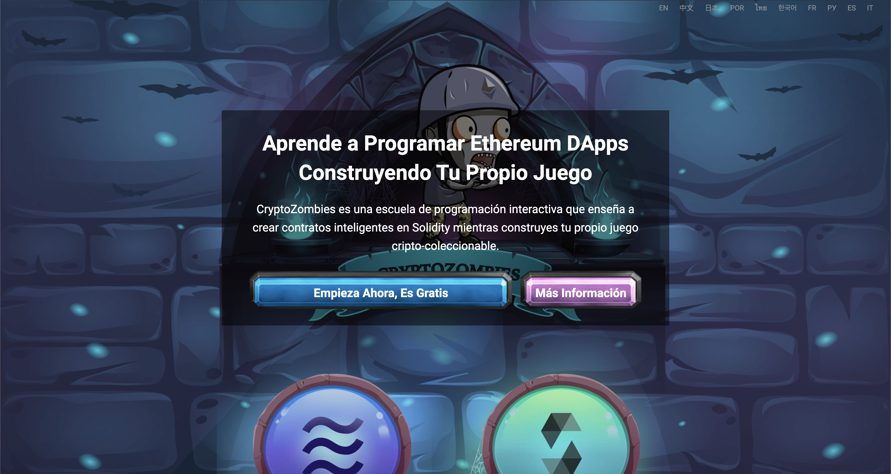
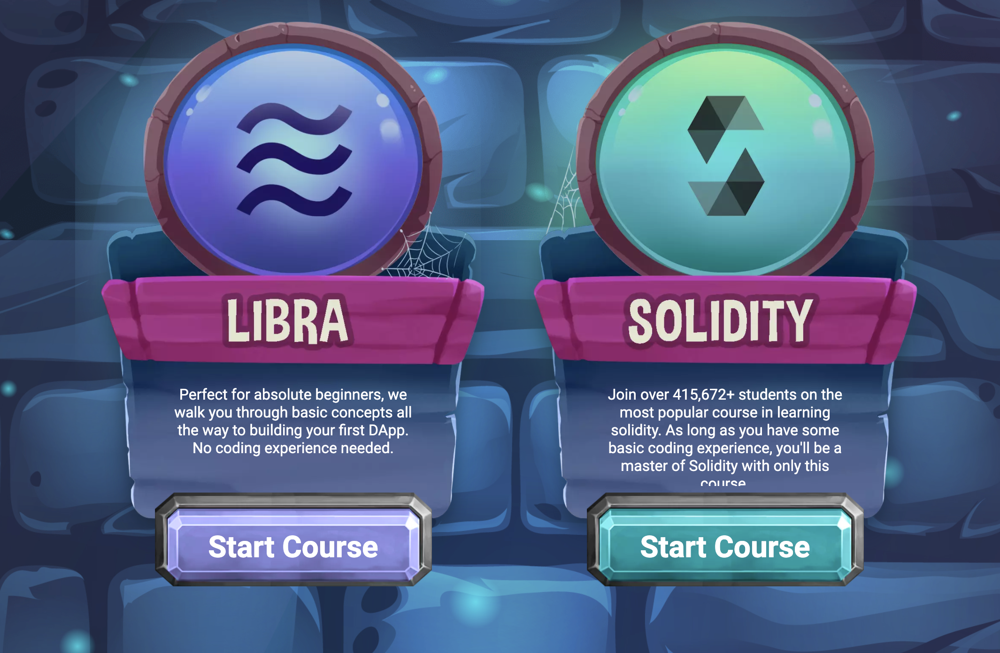

# Cryptozombies: Introduccion a desarrollo con ETH y "Smart Contracts"

Como parte del aprendizaje que voy haciendo sobre las nuevas tecnologías web3 y apps descentralizadas, me recomendaron aprender sobre ETH y smart contracts con la web cryptozombies. En este post voy a tratar de resumir lo que he aprendido en la leccion 1 del mini curso, asi me sirve de documentacion y tambien te puede servir a ti para que veas si de verdad te vale la pena invertir el tiempo en aprenderlo!

## ¿Qué aprenderás en este curso?

Como en su web mensionan:

> CryptoZombies es una escuela de programación interactiva gratuita, que te enseña a crear tus propios juegos basados en Ethereum.
> 
> El curso esta diseñado para principiantes en Solidity y empiezan desde lo más básico. Si nunca has programador en Solidity antes, no te preocupes - te vamos a guiar paso a paso.

Por lo que he visto, es uno de los tutoriales [de código abierto](https://github.com/loomnetwork/cryptozombie-lessons), más visto y usado para empezar a aprender [Solidity](https://soliditylang.org/) y desarrollo de aplicaciones decentralizadas (dApps) y Ethereum. Puedes aprender Solidity o Libra, pero creo que por defecto se hace el Solidity 🤷🏼‍♂️.

El tema que han escogido para enseñar este ecosistema es **la creacion de una maquina de zombies coleccionables** y llegar hasta a combatir con otros zombies!

## ¿Porqué debo aprender esto ahora?

Estamos viviendo un momento en el que la tecnologia esta moviendose cada vez mas ha este sector. Tener en cuenta que la web como la conocemo sahora realmente no tiene mucho tiempo, y ahora con este tipo de tecnologías, creo que podemos llegar a crear una web mucho mas justa y abierta para cualquier persona en todo el mundo. asi que, **Vamos a aprender!**

## Lección 1: Crea una factoria de Zombies

Una factoria de Zombies, basicamente es una "funcion" que a partir de unos parametros que recibe, creara un zombie nuevo cada vez. Mientras vas creando la factoria, te van enseñando temas basicos de solidity como por ejemplo:

- Contratos son el bloque fundamental de una aplicación Ethereum
- curiosidades sobre la sintaxis de como definir variables y tipos de variables
- ejemplos de operaciones matemáticas que son posibles, ademas de cálculos específicos como exponenciales (`5 ** 2` == `5⌃2`)
- Como crear estructuras de datos con valores concretos, igualmente como creas una clase en JavaScript o un tipo de objeto.
- Como trabajar con funciones, como hacer funciones provadas y publicas, puras...
- Que son eventos y como crear/reaccionar a ellos dentro del contrato

Estos conceptos y algunos detallitos mas que puedes aprenderlos tú tambien en el [curso en español](https://cryptozombies.io/es/).

## Conclusiones

Creo que el tema del curso es bastante divertido y ameno para aprender conceptos complejos como la web3 y Ethereum. Si te animas a hacer el curso, escribeme por Twitter para poder compartir experiencias y aprendizajes!
