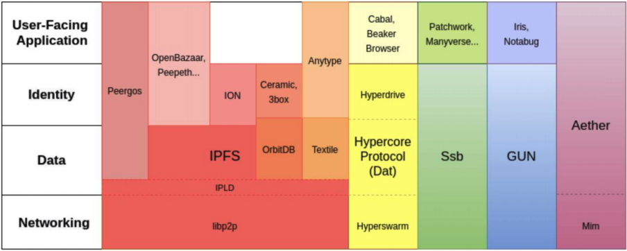
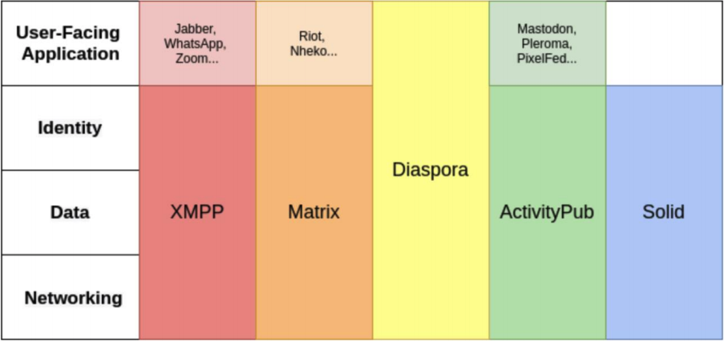

# decentralized social protocols

- [source](https://ipfs.io/ipfs/QmdFrru4PyHzXGZztEPnYToBR3QovD7fkC1HSyty22LzfD)

## Highlights

In the P2P ecosystem, there is sometimes not a clear distinction between protocols and applications, making it unclear what a project encompasses
This diagram attempts to clarify which layer of the stack these P2P projects operate at.

The distinction between protocols and applications is clearer in the federated social ecosystem, where applications follow a familiar client-server model
Diaspora is both the name of the social application as well as the protocol, and Solid does not yet have a social network application.

## Protocols

### ActivityPub

- ActivityPub is a federated protocol that defines a set of interoperable social network interactions through specific APIs.
- ActivityPub consists of two layers: A server-to-server federation protocol and a client-to-server protocol. In order to federate with the ActivityPub ecosystem, a service only has to implement the server-to-server protocol.

- **Identity**: Users in ActivityPub are conceptualized as actor objects. Actor to actor communication bears a resemblance to email. To be spec compliant, each actor must have an "inbox" and an "outbox" endpoint, as URLs which are accessible on the server. They also should have "following" and "followers". They may have "liked" collections and many other predefined possibilities.
- **Networking**: Federated server-to-server protocol that passes messages between systems. ActivityPub messages are not limited to HTTP only. This allows it to potentially be extended in more P2P directions.
- **Data**: messages are objects wrapped in an "activity", indicating what it is. ActivityPub is not opinionated about how messages are persisted on the server as long as each server follows the protocol message requirements.
- **Moderation and Reputation**: Moderation is primarily handled by server implementations. Server admins can block individuals or entire instances. ActivityPub adoption has reached a threshold where spam and harassment have become ongoing problems that protocol developers currently seek to address.
- **Social & Discovery**: Messages are addressed to a user at their home server or published to a public inbox. Normal DNS and IP address routing are used to find the server addressed. There is no global search capability, as each server monitors a different set of messages.
- **Privacy and Access Control**: They are adding E2E encryption. messages were unencrypted on the server.
- **Interoperability**: Any service that implements the ActivityPub server-to-server protocol can interoperate with the ecosystem.
- **Scalability**: more server capacity, more scale
- **Metrics**: https://the-federation.info/
- ActivityPub was based on pump.io and ActivityStreams

### GUN

- GUN is a decentralized graph database with a conflict resolution algorithm (CRDT) and synchronization protocol.
- In GUN's graph store, entries are JavaScript objects under UUID keys.
- Objects can be data of any type, including files, JSON, or other documents
- Data is stored in the browser by default, with backup "superpeers" to ensure persistence.
- Peers connect to other peers and choose what data to synchronize and persist.
- **Identity**
  - human-readable username and password available.
  - Usernames are global but not unique.
  - No password recovery mechanism.
  - [Multi-device login](https://gun.eco/docs/Auth) available
  - Authentication is performed by doing a GUN query for the account username subscribing to it, and then attempting to brute force decrypt the keys of all accounts that match the username until a match is found. Once an account has been loaded once, it's cached on device, loading from local storage or the local hard drive.
  - GUN [SEA](https://gun.eco/docs/SEA) (Security, Encryption, Authorization)
- **Network**
  - [gossip-based protocol](https://gun.eco/docs/DAM) along with a topic-based PubSub protocol to sync data between peers
  - Messages can be routed across different transport layers (WebSockets, WebRTC, multicast UDP, etc.).
  - Peers subscribe to graphs, but GUN graph is accessible to all peers.
  - Planned future network upgrades include the addition of a DHT. A tokenized incentivized mesh proposal is also on the roadmap.
- **Data**
  - Peers subscribe to the data they need and the network retrieves it from any peer
  - _A superpeer_ is an IP addressable machine running node.js that persists data to disk. a "superpeer" is recommended for most applications to ensure availability of data when most browser-based peers may be offline
  - uses CRDT to merge data (lexical sort algorythm to handle conflicts)
  - is [strongly eventually consistent](https://pages.lip6.fr/Marc.Shapiro/slides/CRDTs%20Google%20Zurich-2011-09.pdf)
  - focuses on mutability by not using an append-only log
- **Privacy and Access Control**
  - built into the user system and can be combined with SEA for advance use cases.
  - [Iris-lib](https://github.com/irislib/iris-lib) is a decentralized social networking library built on GUN. It provides an API for end-to-end encrypted chat channels and private contact list management.
- **Interoperability**: plugins
- **Scalability**: rely on relays (superpeers)
- **Metrics**: 10M ~ 30M monthly downloads
- **Monetization**
  - VC-Funded company
  - The business model is based on consulting and integrations.
  - Future business models include a proposed paid service through a blockchain-based tokenized bandwidth incentive network.

### Hypercore Protocol

- Hypercore Protocol (abbreviated Hyper), formerly known as Dat, is a distributed append-only log.
- Dat was renamed Hypercore Protocol in 2020 to reflect the extent of the changes.
- The focus of Hyper is the P2P distribution of an append-only log and its main purpose is to be a building block for other applications.
- **Identity**
  - Nodes are identified using a connection ID which helps avoid duplicate connections.
  - Users publish their information in a data structure identified by a public key. Data in the structure is signed using the matching private key. There is no means for revoking lost keys, as in PGP, and no backing central identity provider that can re-issue a private key
  - Hyperdrives are often used to identify users, behaving as "profiles"
  - In a recent roadmap, the core team has identified plans for authenticating messaging channels by proving ownership of hypercore data structures.
- **Networking**
  - Hypercore data structures are identified by a public key.
  - hyper scheme (`hyper://` + base64-encoded public key as the domain)
  - Hyper uses the [Hyperswarm](https://hypercore-protocol.org/#hyperswarm) networking module.
  - The Hyperswarm DHT includes a hole-punching protocol
  - Hyperswarn is used to bootstrap messaging channels
- **Data**
  - Hyper focuses on mutable data by organizing content under keys. Hyper's primary data structure is Hypercore, a signed append-only log.
  - Hypercore uses a Merkle-tree-based append-only log where each entry generates a new leaf and new root.
  - An improvement added to Hyperdrive that was not present in Dat is the ability to mount hypercore-based structures like a folder of files, creating composed filesystems from multiple different authors.
  - A node must be actively sharing a topic for it to be available. To ensure persistence, nodes can host their own data on a server that stays online or pay a hosting service.
- **Moderation & Reputation**: is a layer below that
- **Social & Discovery**
  - Nodes create "discovery keys" for topics by hashing the public key of the hypercore.
  - The community and core team are actively working on DNS to give short names to keys, so that users can have a "foo.com" address for their topic.
  - Beaker Browser has implemented an informal social protocol on Hyper based on [profile drives](https://docs.beakerbrowser.com/intermediate/your-profile-drive/) and private [address books](https://docs.beakerbrowser.com/intermediate/your-address-book/).
- **Privacy & Access Control**
  - Hypercore Protocol connections are encrypted using the Noise protocol encryption framework (by default).
  - Hyperswarm does not hide user IPs or mask metadata.
  - Hyper data structures can only be accessed by users with knowledge of the public key, they must be shared out of band prior to access.
  - Fine-grained access within Hypercore data structures is not yet implemented.
- **Interoperability**: not. The Hyperdrive data structure is designed to be POSIX-compatible which enables Hyperdrive access via a FUSE interface.
- **Scalability**: not available
- **Metrics**: 300 to 400 nodes in the Hyperswarm DHT as of June 2020
- **Governance & Business Models**: Blue Link Labs's business model is to run cloud Hypercore hosting services.
- **Implementations**: Beaker Browser
