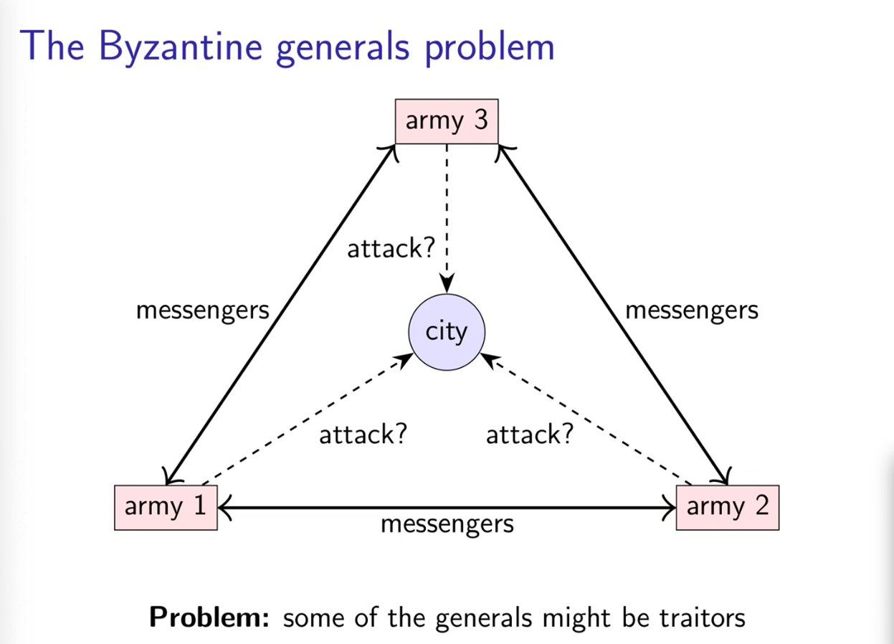
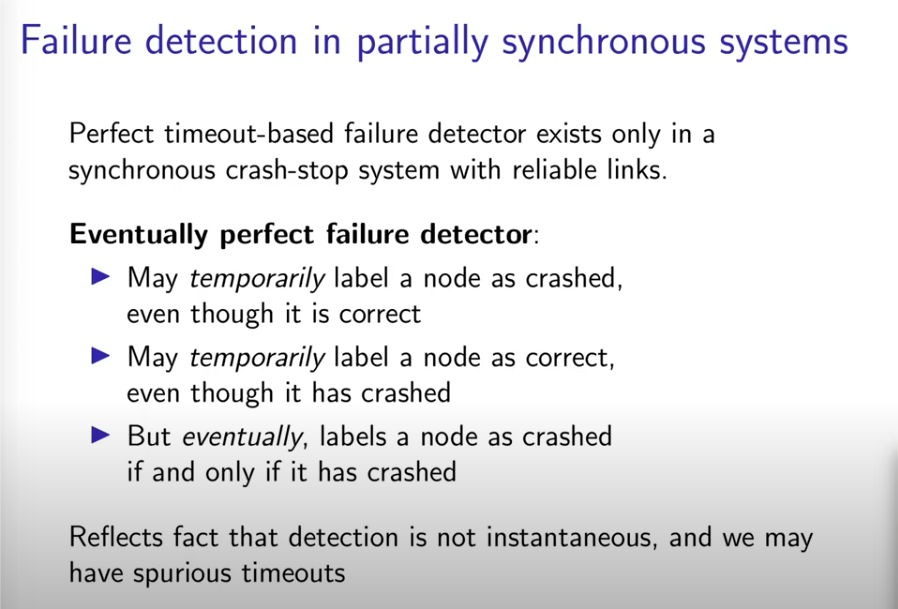
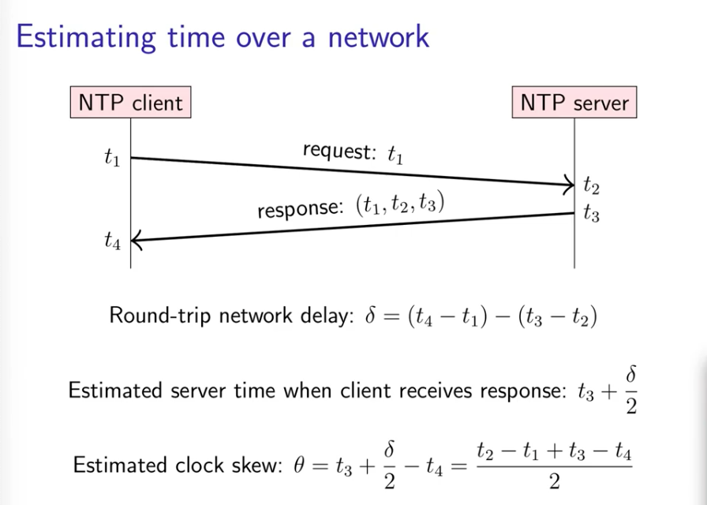

# Distributed Systems Lectures

by [[Martin Kleppmann]]

- [Source](https://www.youtube.com/playlist?list=PLeKd45zvjcDFUEv_ohr_HdUFe97RItdiB)
- [Lecture notes](https://www.cl.cam.ac.uk/teaching/2021/ConcDisSys/dist-sys-notes.pdf)
- [Slides](https://www.cl.cam.ac.uk/teaching/2021/ConcDisSys/dist-sys-slides.pdf)

## 1.1 Introduction

- [video](https://www.youtube.com/watch?v=UEAMfLPZZhE&list=PLeKd45zvjcDFUEv_ohr_HdUFe97RItdiB)
- [Leslie Lamport](http://www.lamport.org/): legend in this area
- Why make a system distributed?
  - inheritance
  - better reliability (fault tolerance)
  - better performance
  - solve bigger problems
    - some roblems or operations cannot be solved on one computer
- Disadvantages
  - Communication may fail: no Internet or problems with the network
  - Processes may crash
  - Non-deterministic events or all can happen nondeterministically
  - **Fault Tolerance**: we want the system as a whole to continue working, even when some parts are faulty.
  - is Hard!

## 1.2 Computer Networking

- [video](https://www.youtube.com/watch?v=1F3DEq8ML1U&list=PLeKd45zvjcDFUEv_ohr_HdUFe97RItdiB&index=2)
- Any computer device is called a `Node`
- one Node can send a message to another node.
- in reality it depends on many things and network infra
- Latency: time to communicate from one node to another
- Bandwidth: data volume per unit time
- the web is an example of a Distributed System
  - the nodes are the client and the server
  - the type of messages are the request from the client to the server and the response message from the server to the client
  - bandwidth in the web is limited to the amount of size the messages
- Messages are not individual TCP packets.

## 1.3 Remote Procedure Call

- [video](https://www.youtube.com/watch?v=S2osKiqQG9s&list=PLeKd45zvjcDFUEv_ohr_HdUFe97RItdiB&index=3)
- Client-server example: Online Payments
  - the implementation of the payment function is underneath translated to some sort of a network communication (implemented in the other service/node)
- how RPC is implemented
  - a function is called outside the service
  - that function is a stub that forwards all the paramenters to the system (marshal args)
  - the response of that function will be returned (marshaled)
  - ideally RPC makes a call to a remote function look the same as a local function call
- Location Transparency: System hides where a resource is located
- REST is an implementation of RPC

### Service-oriented Architecture (SOA) / "microservices"

- split a large software application into multiple services (on multiple nodes) that communicate via RPC
  - Interoperability: Datatype conversions
  - Interface Definition Language (IDL): Language-independent API specification
- RPC is hte way that different services implemented in different technologies can talk to each other

## 2. Models of Distributed systems

- descriptions of the assumption that we make when we design an algorythm

### 2.1 The two general problems:

- [video](https://www.youtube.com/watch?v=MDuWnzVnfpI&list=PLeKd45zvjcDFUEv_ohr_HdUFe97RItdiB&index=4)


- this problem illustrates the issue of uncertainty that exists in a distributed system when we are not sure if the message got through or not

### 2.2 The Byzantine Generals Problem

- [video](https://www.youtube.com/watch?v=LoGx_ldRBU0&list=PLeKd45zvjcDFUEv_ohr_HdUFe97RItdiB&index=5)
- Some of the generals might be traitors




- Up to f generals might behave maliciously
- Honest generals don't know who the malicious ones are
- the malicious generals may collude
- Honest generals must agree on a plan
- we need 3f + 1 generals in total to tolerate f malicious generals (more than 1/3 of the total)
- Cryptography can help (with digital signatures) but problem remains hard
- this problem illustrates the issues you can have when participants don't fully trust each other

### 2.3 System models

- [video](https://www.youtube.com/watch?v=y8f7ZG_UnGI&list=PLeKd45zvjcDFUEv_ohr_HdUFe97RItdiB&index=6)

- capture assumptions
  - Network behaviour
    - bidirectional **point-to-point** communication between 2 nodes with:
      - Reliable: will be receive if and only if is sent
      - Fair-loss link: if you keep trying, a message eventually gets through
      - Arbitrary links: interferance with the message
    - the thing about this three models is that you can change one to another.
      - fair-loss to reliable
      - arbitrary to fair-loss
  - Node Behaviour
    - Crash-stop (fail-stop): the node crash and stop working
    - Crash-recovery (fail-recovery): it will resume, but all in-memory state will be lost
    - Byzantine (fail-arbitrary): a node just got crazy and do whatever it wants
  - Timing behaviour
    - Synchronous: message latency no greater than an upper bound
    - Partially Synchronous: async for finite periods of time. Networks do work on a partially synchronous way.
    - Asynchronous: can be delayed arbitrary
- Real-time operating systems (RTOS) provide schedulling garantees, but most distributed systems does not use RTOS)
- whatever part you choose, you need to make sure your assumption **is correct**

### 2.4 Fault tolerance

- [video](https://www.youtube.com/watch?v=43TDfUNsM3E&list=PLeKd45zvjcDFUEv_ohr_HdUFe97RItdiB&index=7)

- Availability
- **Availability = uptime = fraction of time that a service is functioninf correctly**
  - "Two nines" = 99% up = down 3.7 days/year
  - "Three nines" = 99.9% up = down 8.8 hours/year
  - "Four nines" = 99.99% up = down 53 minutes/year
  - "Five nines" = 99.999% up = down 5.3 minutes/year
- Terms you get on availability:
  - Service-level Object (SLO): brake the availability in requests
  - Service-Level Agreement (SLA): contract that specify what to expect
- Failure: System as a whole is not working
- Fault: some part of the system are not working
- Fault tolerance: system continues to work despite any faluts
- Single point of Failure (SPOF): if that part fails, the whole system crashes.
  - we should design our systems without a SPOF.
- Failure detectors:
  - algorythm that detects when a part, some parts or the whole system fails
  - depending on the type of system and assymptions we choose the type of algorythm can work more or less
  - **Eventually perfect failure detection**
    

## 3. Time, clocks and ordering of events

- [video](https://www.youtube.com/watch?v=FQ_2N3AQu0M&list=PLeKd45zvjcDFUEv_ohr_HdUFe97RItdiB&index=8)

- Distributed systems need often a measure of time
  - schedulers, timeouts, failure detectors...
- we need time to know in which order we need to apply events in distributed systems
- types of clocks:
  - physical clocks: caunt number of seconds elapsed
  - [Logical clocks](#logical-clocks): count events (messages sent)
- Clock in digital electronics (oscillator) != clock in distributed systems (source of **timestamps**)

### 3.1 Physical Time

- common clocks are created using Quartz (cristal)
- **Quartz clocks** can go wrong depending on the temperature they are.
- **Atomic clocks** are much more accurate.
- you can build a GPS with an Atomic clock
- Coordinated Universal Time (UTC) is International Atomic time (TAI) with corrections to account for Earth rotation
- Representations of time in computers
  - **Unix time**: number of seconds since 1-january-1970 (not counting leap seconds)
  - **ISO 8601**: year, month, day, hour, minute, second and timezone offset relative to UTC
- computers _ignore_ leap seconds!! XD
- However, OS and DistSys need timings with sub-second accuracy
- 20 June 2012: bug in Linux kernel caused livelock on leap second, causing many internet services to go down
- Pragmatic solution: **smear** (spread out) the leap second over the course of a day. Not an elegant hack but solves the problem.

### 3.2 Clock Synchronisation

- [video](https://www.youtube.com/watch?v=mAyW-4LeXZo&list=PLeKd45zvjcDFUEv_ohr_HdUFe97RItdiB&index=9)

- Due to **clock drift**, we end up with **clock skew**: which is the difference between two clocks at a point in time.
- with clock synchronisation, we want to minimize this skew as much as possible
- impossible to be zero, but we can reduce it as much as we can
- protocols:
  - Network Time Protocol (NTP)
  - Precision Time Protocol (PTP) (not covered in this course)
- its solved by sincying local clocks with server clocks using NTP

#### Network time Protocol (NTP)

- many OS vendors run NTP servers
- Hierarchy of clock servers arranged into **strata**:
  - Stratum 0: atomic clock or GPS receiver
  - Stratum 1: synced directly with _stratum 0_ device
  - Stratum 2: synced directly with _stratum 1_ device, etc
- be careful when you asume synchronize clocks
  
- Time of day clock
  - Time since a fixed date
  - May suddenly move forwards or backwards (subject to leap second adjustments)
- Monotonic clock
  - Time since arbitrary point (when the machine booted up)
  - Always moves forwards at a near-constant rate
  - Good for measuring Time elapsedon a single node

### 3.3 Causality and happens-before

- [video](https://www.youtube.com/watch?v=OKHIdpOAxto&list=PLeKd45zvjcDFUEv_ohr_HdUFe97RItdiB&index=10&t=1s)

- messages can arrive in the wrong order
- you cannot rely on a timestamp either because each node clock could not be synchronize or inconsistent
- here comes the **happens-before** relation

#### Happens-before relation

- event: something that happens on a **node**
- happens-before = **a -> b**
- we can ensure this if:
  - _a_ and _b_ occurred in the same node
  - _a_ and _b_ are unique
  - if _c_ exists: _a -> c and c -> b_
- the happens-before is a partial order. if neither a -> b nor b -> a then a and b are **concurrent** (a || b)
- **concurrent** does not mean happened at the same time, it means that both events does not know about each other.
  
- Happens-before is very close related to **Causality**

#### Causality

- Happens-before relation encodes **potential causality**
- when a -> b, then _a_ might have caused _b_
- **causal order**: way of putting the event in the system in order that is consisten with the causality

- **"CAUSAL" !== "CASUAL"**

### 4. Broadcast protocols and logical time

- [video](https://www.youtube.com/watch?v=x-D8iFU1d-o&list=PLeKd45zvjcDFUEv_ohr_HdUFe97RItdiB&index=11)

#### Logical Clocks

- designed to capture causal dependencies
- Types of logical clocks:
  - Lamport clocks
  - Vector clocks

##### Lamport Clocks


- Give us a way of attaching timestamps to all events in a system in a way that captures the happens-before relationship
- each node maintains a counter _t_ incremented on every local ecent _e_
  
- properties
  - if _a -> b_ then _L(a) -> L(b)_
  - However, _L(a) -> L(b)_ does not imply _a -> b_, because both events could be concurrent. we can make sure that the timestamps order is this one, but not the other way around.
  - Possible that _L(a) == L(b)_ for _a !== b_
- limitations:
  - if _L(a) < L(b)_ we can't tell wether _a -> b_ or _a || b_
  - if we want to detect which events are concurrent, we need **Vector clocks**

##### Vector Clocks


- a vector reprensent a set of events of each node in the system and represented like a list of all highest events on each node.
- for example: <2, 2, 0> (<A, B, C>) represents the first to events from node A, the first two events from node B and no events from node C.


- knowing all node vectors, we can compare them!
- vector clocks help us to have a bidirectional implication between partial ordet and causality

```
(V(a) < V(b)) <==> (a -> b)
(V(a) == V(b)) <==> (a == b)
(V(a) || V(b)) <==> (a || b)

# <==> => "if and only if"
```

## References

- "Distributed Systems": van Steen & Tanenbaum
- "introduction to Reliable and Secure Distributed Programming": Cachin, Guerraoui & Rodrigues
- "Designing Data-Intense Applications": Martin Kleppmann
- "Operating Systems: Concurrent and Distributed Software Design": Bacon & Harris
- [Course Materials](https://www.cl.cam.ac.uk/teaching/2021/ConcDisSys/materials.html)
- [Supervision 0: Get Started Questions (DJ Greaves)](https://www.cl.cam.ac.uk/teaching/2021/ConcDisSys/djg-materials/s0.pdf)
- [Supervision 1: Semaphores, generalised producer-consumer, and priorities](https://www.cl.cam.ac.uk/teaching/2021/ConcDisSys/djg-materials/s1.pdf)
- [Supervision 2 (Rev B): Transactions](https://www.cl.cam.ac.uk/teaching/2021/ConcDisSys/djg-materials/s2.pdf)

[//begin]: # "Autogenerated link references for markdown compatibility"
[Martin Kleppmann]: martin-kleppmann "Martin Kleppmann"
[//end]: # "Autogenerated link references"

```

```
