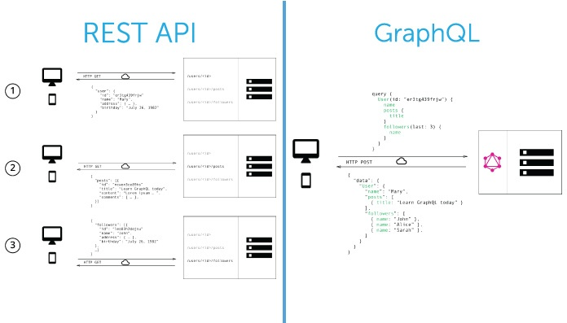
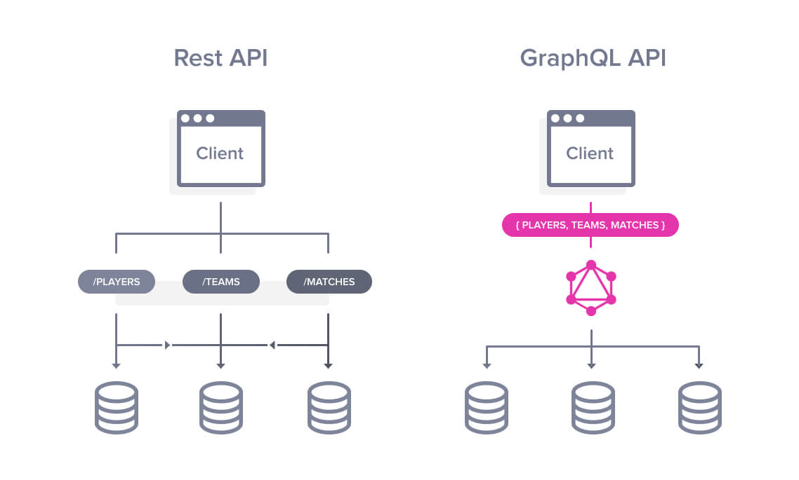

# Graphql

## What we will do in this workshop

- Theory about GraphQL
- play with GraphQL
- create our first GraphQL API (AWS Amplify)

## Introduction

- is a Query language definition, not a language itself
- it defines a type system for your API data
- is platform/technology agnostic. you can use it with any language or storage of your choice
- "GraphQL Queries is like a JSON without the values"
- all POST requests
- by adding types to the data you request, you can give control to the frontend on WHAT to ask, but the control on how that data is retrieve from the database is still in the backend.
  
  

### Queries and Mutations

#### Query

- https://graphql.org/learn/queries/
- is like a JSON without the values
- you ask for exactly what you want, not what the API can offers
- you can make queries as complex as your data needs
- the way you ask for data is in a hierarchical way, and that is useful because modern application can be also represented as hierarchical structures, making easier to request the data you really need on your UI.
- you can add arguments to queries [link](https://graphql.org/learn/queries/#arguments)
- and named arguments too!
- `aliases` let you rename the result of the queries you do [link](https://graphql.org/learn/queries/#aliases)
- **Fragments** are reusable units of a query you can use and reuse in your API. [link] (https://graphql.org/learn/queries/#fragments)
- you can also name queries to help on debugging and make your queries/mutations/subscriptions more semantic
- variables [link](https://graphql.org/learn/queries/#variables)
  - default variables
  - Directives!!! (NEW) [link](https://graphql.org/learn/queries/#directives)
  - Required Values

#### Mutations

- the way to change data in your database
- any operation that causes writes, should be sent as a mutation
- mutations can return any object tye and you can get the data the same way you do on a Query
- While query fields are executed in parallel, mutation fields run in series, one after the other. (avoid race conditions)

### Inline Fragments

- [link] (https://graphql.org/learn/queries/#inline-fragments)
- its a usefull way to express a query depending on the type of object you receive (Character + Droid + Human example)

## Resources

- https://rickandmortyapi.com/graphql
- https://sandbox.amplifyapp.com/
- https://docs.amplify.aws/start
- [How to GraphQL \- The Fullstack Tutorial for GraphQL](https://www.howtographql.com/)
- [GraphQL Recipes v2: Building APIs with GraphQL Transform](https://dev.to/open-graphql/graphql-recipes-building-apis-with-graphql-transform-3jp0) #dev #web #graphql #recipes #resources #tutorial

## Exersice 1

- Query a list with all the characters and retrieve the name and species for each
- Query a single character by id (try id equals "id": "18") and get its name and species
- Query how many locations are in the system?
- How many types do we have in the system?

## feedback

- after `amplify configure` it sends them to enable 2FA for new accounts
