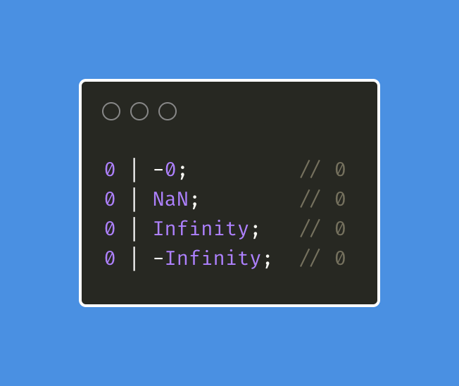
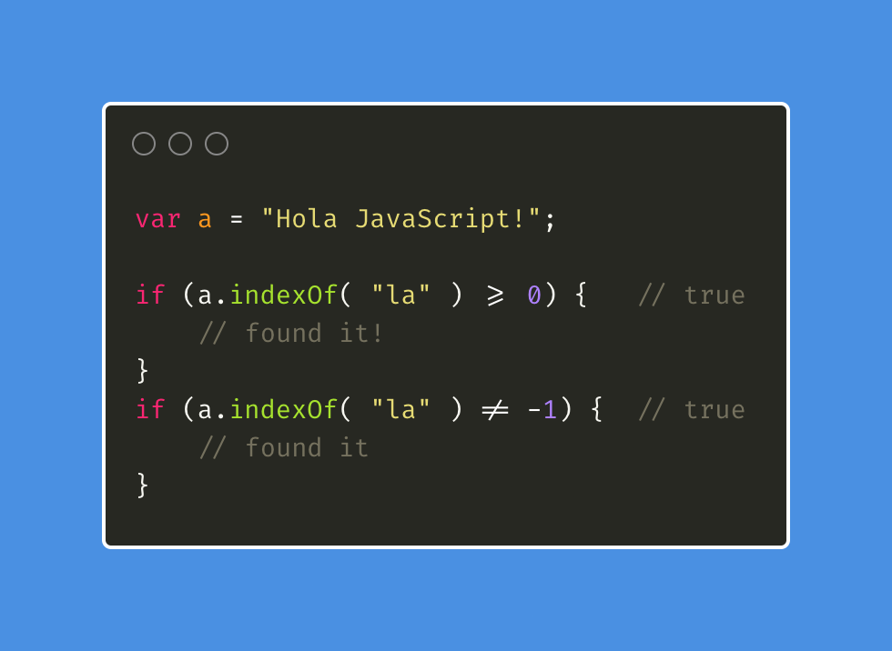

# Bitwise NOT

## Introducción

AQUÍ LES VA LA RESPUESTA!!!

Por si no viste el tweet, [aquí](https://twitter.com/hhg2288/status/1423046322597281792) te lo dejo!

**la respuesta correcta es "true"**.

```js
var a = "Hello World"
var resultado = !!~a.indexOf("lo") // true
```

Veamos en detalle lo que significa "~" 👇🏼👇🏼

## Bitwise NOT

_Bitwise NOT_ (`~`) es un operador muy poco conocido y menos usado. Creo que después de la explicación no creo que lo quieras usar igualmente, pero mantengamos el espíritu de exploración y veamos en qué casos puede ser útil!

Tanto este operador como el "pipe" (`|`) son operadores que convierten los valores a valores de 32bits. Antes de hacer esta conversion (implícita o explícita) siempre intenta convertir el valor a tipo "number". pero no todos los valores son 32bit-safe.. ¿Qué hacemos entonces?

En el caso de encontrarse con un número que no es "32bit-safe", el resultado es `+0`



¿Pero esto qué tiene que ver con "~"??? ya vamos a explicarlo!!

`~` primero convierte (coerción) el valor a un número que ocupa 32 bits, y luego hace una negación bit a bit (invirtiendo cada bit con su negación)

😱🤯🤔

OK, un poco raro sí!! veámoslo de otra forma mas sencilla:

"~" se puede decir que es lo mismo a "-(x+1)"

~24 ➡️ -(24 + 1) ➡️ -23

Sabiendo esto podemos afirmar:

"el operador "~" usado en un rango de valores numéricos devolverá 0 o un valor "falsy" (o fácilmente convertible a "false" con coerción) si el input es el número -1, y cualquier otro número "truthy" si em input es diferente

🔥🔥

el uso del -1 como valor que define la búsqueda sin resultado (o ausencia de algo) en un conjunto de valores, y JavaScript no se queda atrás con el método "String.indexOf()"

Seguro has usado éste método para comprobar si una cadena de texto está presente total o parcialmente en otra cadena de texto.



Ahora bien, conociendo lo que el `~` da como resultado, ves una mejor manera de expresar la presencia o ausencia de una cadena de texto sin tener que ser "redundante" o escribiendo menos código?? Volvamos a ver el código de la pregunta!

```js
var a = "Hello World"
var resultado = !!~a.indexOf("lo")
```

resultado **SÓLO** puede ser o `-1` o cualquier numero positivo. Lo que hace el valor de resultado `true` cuando NO es `-1` y `false` cuando es cualquier otro número!

Sinceramente me parece que si evitamos el uso de `>= 0` o `== -1` (en incluso peor `=== -1`) tendremos operaciones "menos redundantes". También he de aclarar que conocer sobre este operador no es habitual, asi que al usarlo en tus programas, te aconsejo que dejes un link a la explicación del mismo (este post o la misma especificación!). Recuerda que **escribimos códio para personas, no para máquinas**!

Puedes leer más sobre éste operador [en el libro](https://github.com/getify/You-Dont-Know-JS/blob/1st-ed/types%20%26%20grammar/ch4.md#the-curious-case-of-the-) de [@getify](https://twitter.com/getify) y también puedes leer la especificación de este operador [aquí](https://tc39.es/ecma262/multipage/ecmascript-language-expressions.html#sec-bitwise-not-operator)
