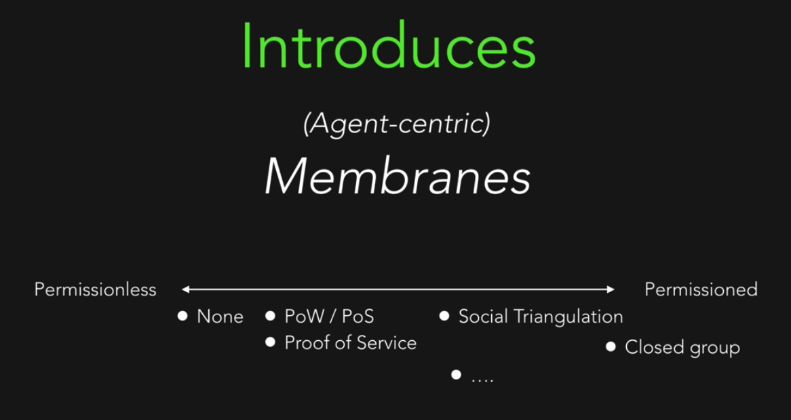

# Holochain Explained

- [video](https://www.youtube.com/watch?v=hyCtYrHJebs)

- framework to build fully distributed P2P apps
- is not blockchain
- is an agent-centric approach, not data-centric like a normal blockchain
- does not force concensus
- each agent is maintaining its own history, its own temper proof
- everything an agent authors are signed
- implements a DHT as the public space
- replicas of content are not on each agent, but a limited number
- there are concensus on the validation rules
- each agent have its own DNA. malicious entries
- 
