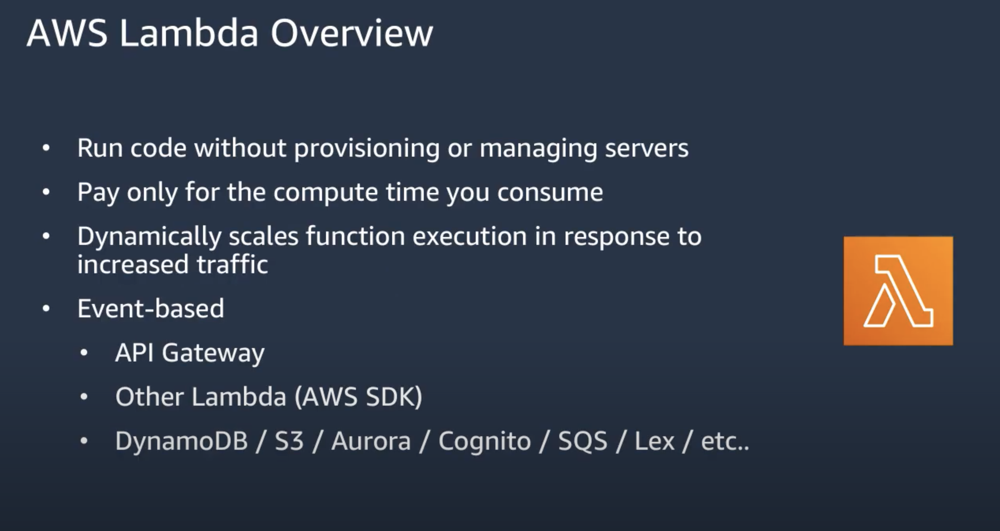

# AppSync as an API Gateway

When building a GraphQL APIs it is common to have existing microservices served via traditional REST APIs that need to be integrated into the schema and accessed via GraphQL queries and mutations. In this talk, you'll learn how to add custom HTTP and Lambda function resolvers to map existing REST endpoints and other API calls directly from Amplify.

## Main talk layout

- Intro
  - Mintter
  - aprendegatsby
  - content (YT, Twitch, Twitter)
- Talk index
- Startups needs to be prepare to pivot and change quickly, and Amplify helps to do that with how simple it is to do crazy stuff
- GraphQL intro
  - plug video series in spanish
  - what they are
  - what you can do with them
  - getting started
  - deploy using Amplify
- Serverless functions Intro
  - what they are
  - what you can do with them
    - [Deploy a Lambda function with API Gateway](#lambda-function-api-gateway)
  - different types
  - getting started
  - deploy using Amplify
- Demos explanation
  - newsletter
  - contact form (cloud formik)
  - e-commerce checkout (happori example)
  - REST api migration (Rick and Morty API)

### Deploy a Lambda function with API Gateway {#lambda-function-api-gateway}

1. Create a Lambda function and API (REST HTTP endpoint)

```bash

amplify add function
amplify add api

// Choose REST with Express backend
```

2. Write code / make changes to your lambda functions
3. Deploy (or mock)

```bash
 amplify push
```

### AWS Lambda Overview



- Run code without provisioning or managing any servers
- pay only for the compute time you consume
- Dynamically scales function execution in response to increased traffic
- Event-based
  - API Gateway
  - Other Lambda (AWS SDK)
  - DynamoDB / S3 / Aurora / Cognito / SQS / Lex / etc

### Demo Serverless function

1. create a new react app

```bash
npx create-react-app demo-sls-app
cd demo-sls-app
amplify init
```

1. Init the amplify client SDK

```bash
amplify init
```

1. Start adding services

- you can also run `amplify status` to check all the services installed and available

- fill the questions with almost all the default answers (or the ones that suits best your environment/needs)

1. Setup an AWS profile (if you don't already have one)

- again, fill the questions with almost all the default answers (or the ones that suits best your environment/needs)

1. add your first function

```bash
amplify add funtion
```

- follow the questions
- template types:

  - Hello world function: simple function
  - CRUD for DynamoDB table: all the normal CRUD operations
  - Serverless express function: it allow us to run an full Express server in a serverless function. it will generate a normal server code node app function in your project

- for this example we will use **serverless express**

1. Setup the React app

- install `aws-amplify` in the React app (check the docs)
- `Amplify.configure(config)` inside the root component
- call the new endpoint using the `API` category from `aws-amplify`

```js
try {
  const data = await API.get("ENDPOINT_NAME", "/ENDPOINT_PATH");
} catch (err) {
  console.error(err);
}
```

1. Install axios on our functions

- that way we can do HTTP request to other REST APIs from our functions
- you need to install it inside the specific function's folder (where you see the `package.json` file). then you can do `yarn add axios`
- then you can do a normal API call to your other REST API and return its data to your serverless function

- you can even add authentication to an specific endpoint! 🤯
- you can modify any services using `amplify update <SERVICE>`

### Multiple environments

- using `amplify env`
- create a new one: `amplify env add`

---

## Resources

### Docs

- [Amplify JS docs](https://docs.amplify.aws/start/q/integration/js)

### Videos

- [Transforming REST APIs to GraphQL with AWS AppSync](https://www.youtube.com/watch?v=4dZ91AarhPg)
- [Serverless Functions in Depth with AWS Amplify](https://www.youtube.com/watch?v=y4Obz26GkCk)
- [Transforming REST APIs to GraphQL with AWS AppSync](https://www.youtube.com/watch?v=4dZ91AarhPg)
- [Creating & Interacting with an AWS AppSync GraphQL API with React & AWS Amplify](https://www.youtube.com/watch?v=pZ61oDwrCK0)
- [Developing and Implementing APIs at Scale, the Serverless Way](https://www.youtube.com/watch?v=v9USkR6HTug)
- [Egghead course: Building Serverless Web Applications with React & AWS Amplify](https://egghead.io/courses/building-serverless-web-applications-with-react-aws-amplify)
- [Transforming GraphQL: Full Stack Infrastructure as Code](https://www.youtube.com/watch?v=yR-gJ2hMIPk)

### Posts and Content

- [How to Build Serverless GraphQL and REST APIs Using AWS Amplify](https://code.tutsplus.com/tutorials/how-to-build-serverless-graphql-and-rest-apis-using-aws-amplify--cms-31873)
- [Serverless chats's Podcast episode #28: Amplifying Serverless with Nader Dabit](https://www.serverlesschats.com/28)
- [Simplify access to multiple microservices with AWS AppSync and AWS Amplify](https://aws.amazon.com/blogs/mobile/appsync-microservices/)
- [How To Use AWS AppSync in Lambda Functions](https://janhesters.com/how-to-use-aws-appsync-in-lambda-functions/)

### Repos

- [Examples of various Lambda function integrations with API Gateway and CORS enabled](https://github.com/dabit3/api-gateway-lambda-in-various-runtimes)
- [Live Streaming with React & AWS](https://github.com/dabit3/react-aws-live-streaming)
- [Lambda GraphQL Resolver Examples](https://github.com/dabit3/lambda-graphql-resolver-examples)
- [Code examples for my book Full Stack Serverless with O'Reilly Publications](https://github.com/dabit3/full-stack-serverless-code)
- [Basic serverless API](https://github.com/dabit3/basic-serverless-api)
- [Building Web Applications with AWS Amplify](https://github.com/dabit3/aws-amplify-workshop-web)
- [DynamoDB Lambda Trigger examples](https://github.com/dabit3/dynamodb-triggers)
- [Code and examples from my talk - Curious Cases of GraphQL](https://github.com/dabit3/curious-cases-of-graphql)

### Other

- https://pages.awscloud.com/rs/112-TZM-766/images/2018_0821-MBL_Slide-Deck.pdf?mkt_tok=eyJpIjoiWVdZME5qQXlPVE5oTmpNeiIsInQiOiJnOGxJOFdFUklrYW1TRHpYVUY5ckFubzF2bkVhdHNJU0U1Ylhsc1FoSkw1T0ZlVGVKK01Hck9CNFR0dVhqZWMxQnIzMkpcL1wvWmFlREZMVWlkNlhHbXRuZFkwa21uUzFXdWcwNWVFajV6SDllblFqR2hvTnBjc2RBQzNmRThWM2l6cEQ1aDRGc284MFN5K09xK3l5UXZkUT09In0%3D
- https://docs.amplify.aws
