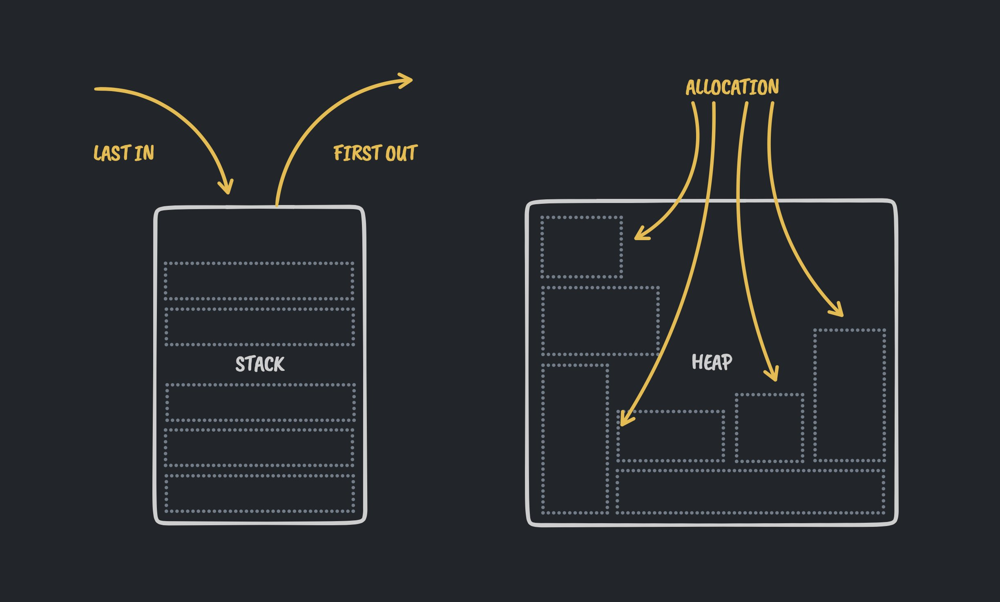

# rust-ownership

## Stack and Heap

- Both the stack and the heap are parts of memory available to your code to use at runtime
- **The stack** store adds and removes values from the same side (_last in, first out_)
- **the heap** is more disorganized. is like in a restaurant, you say the amount of people you are (your size in memory) and the waiter will _allocate_ you in the best place in the restaurant.
  - every time you _allocate_ something in the heap, you get a pointer to the place in memory to it.
- allocating to the stack is not a term used. you _push to the stach_, not allocate.
- Ownership rules:
  - Each value in Rust has an owner.
  - There can only be one owner at a time.
  - When the owner goes out of scope, the value will be dropped.

### Ways Variables and Data Interact

- This is only valid for values that are hard to know its memory size beforehand, for example strings. This does not happen for integers, since ints size is known beforehand, so is trivial to create them in the heap.

- Move:
  - when you assign a variable to another, the first variable is considered to be _moved_.
  - this just creates a new pointer and invalidate the previous pointer to the value in the heap
- Clone:
  - this will not invalidate the pointer from the previous variable and also _clones_ the value in the heap.

### Stack-only data:

- ## Copy
