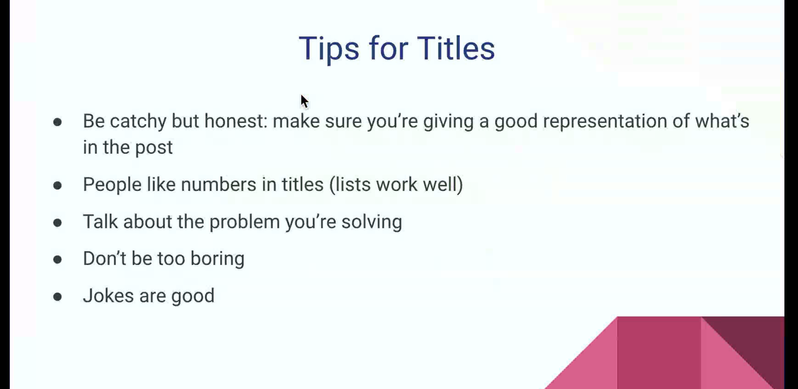
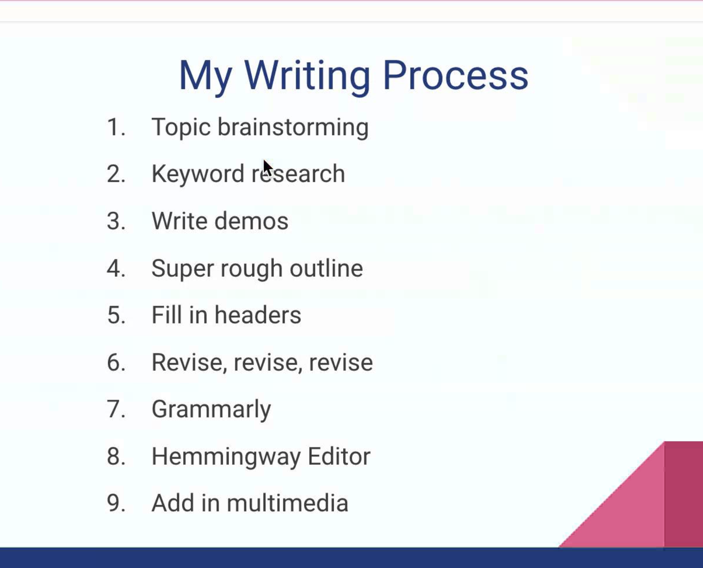
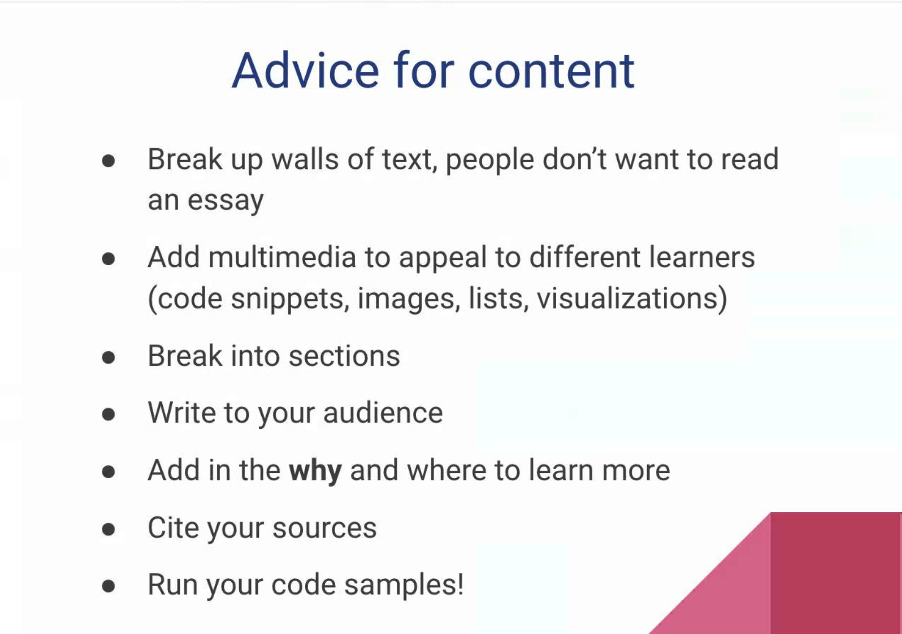

# “Content Development Workshop: Blogs” with Ali Spittel, Sr. Developer Advocate, AWS Amplify

- by Ali Spittel

---

1. How to start
2. Content
3. Getting an Audience

- writing is hard.
- you can get job opportunities
- you write for yourself
  - your past-self
  - your current-self
  - rout future-self

## tips

- naming things
  - SEO
  - come up with something funny
- target audience
  - who do you want to read your writing?
  - how do you want them to read it?
  - define Personas
    - put yourself in their shoes
  - be concious about how you pitch yourself to others
    - people like stories, use them
- come up with a topic
  - choose three biggest problems. and write about how yo solve those three biggest problems
- choose your blogging platform
- make writing an event in your calendar
  - batching!!
- topics to write
  - demo projecets
  - getting started guides
  - common stumbling points
  - your story
  - something you googled a bunch and was hard to find an answer
  - your struggles
- write down topics to write when you think of them, not when you have time to write
- title tips
  - be catchy but honest
  
  - numbers on titles
- writing process
  
- advice for content
  

## Audience

- don't rely on just one source
- engage in already created conversations
- SEO
  - keyword research
    - mangools
    - ahrefs
    - keywords everywhere
  - domain authority
    - backlinks through social media
  - site quality
    - lighthouse
- Email lists!
  - create one
- cross-post
  - canonical url
  - post elsewhere
  - post the full article anywhere
- CONSISTENCY
  - not important to be explicit
- other writer advocates
  - think media (YT channel)
  - here podcast